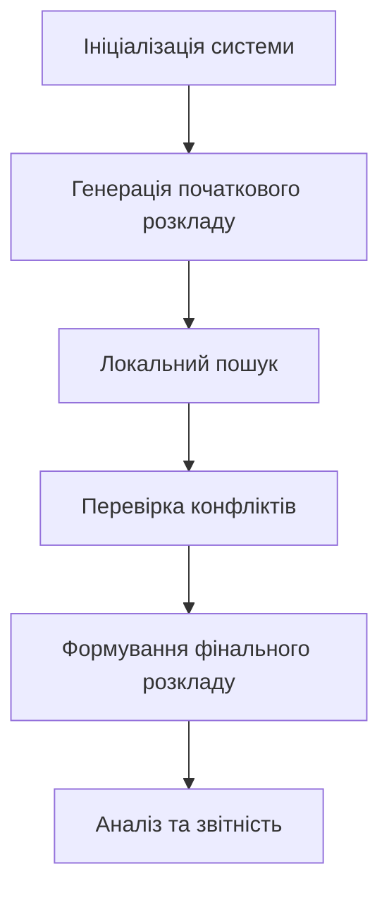

# РОЗДІЛ 2. ПРОЄКТУВАННЯ ТА РЕАЛІЗАЦІЯ ПРОГРАМНОГО МОДУЛЯ

## 2.1 Розробка основного компонента програми

Інтелектуальний модуль складання розкладу призначений для автоматизації процесу формування розкладу занять у навчальних закладах. Основна мета модуля — забезпечити ефективний розподіл ресурсів (аудиторій, викладачів, груп студентів) з урахуванням заданих обмежень і критеріїв оптимальності. Для досягнення цієї мети використано підхід з підкріплювальним навчанням (Proximal Policy Optimization, PPO), який дозволяє агенту навчитися приймати рішення в складному середовищі з багатьма змінними.

### Використання підходу з підкріплювальним навчанням

Метод PPO обрано через його здатність ефективно працювати в середовищах з великим простором дій і станів. Цей алгоритм забезпечує стабільність і швидкість навчання завдяки використанню обмеження на оновлення політики агента. У контексті складання розкладу, PPO дозволяє агенту поступово покращувати свої дії, враховуючи як поточні обмеження, так і довгострокові цілі.

### Роль класу `PPOTrainerV2`

Клас `PPOTrainerV2` відповідає за навчання агента та генерацію розкладу. Основні функції цього класу:

- Ініціалізація моделі актора-критика.
- Проведення епізодів навчання в середовищі.
- Збір і аналіз статистики для оцінки якості розкладу.
- Інтеграція локального пошуку для покращення результатів.

### Середовище `TimetablingEnvironmentV2`

Середовище `TimetablingEnvironmentV2` моделює процес складання розкладу. Воно забезпечує:

- Визначення станів і дій агента.
- Розрахунок винагороди за кожну дію.
- Перевірку обмежень (зайнятість викладачів, груп, аудиторій, місткість, часові слоти).
- Генерацію початкового розкладу.

### Етапи формування розкладу

1. **DRL-фаза (Deep Reinforcement Learning):**
   Агент PPO взаємодіє із середовищем, поступово навчаючись приймати оптимальні рішення. На цьому етапі формується базовий розклад.

2. **Local Search:**
   Після генерації початкового розкладу застосовується локальний пошук для усунення конфліктів і покращення розподілу ресурсів.

3. **Greedy Fill:**
   Використовується для заповнення залишкових слотів у розкладі, забезпечуючи його повноту.

4. **Механізм виправлення конфліктів:**
   Виявлені конфлікти (перетин занять, перевищення місткості аудиторій) автоматично виправляються шляхом перестановки занять або зміни слотів.

### Гарантія повноти розкладу

Повнота розкладу забезпечується через багатокроковий підхід, який включає перевірку всіх обмежень і використання жадібних алгоритмів для заповнення пропусків. У разі неможливості задовольнити всі обмеження, система генерує звіт із зазначенням проблемних місць.

### Облік обмежень

Система враховує такі обмеження:

- **Зайнятість викладачів:** кожен викладач може проводити лише одне заняття в заданий час.
- **Зайнятість груп:** кожна група студентів може бути присутньою лише на одному занятті одночасно.
- **Аудиторії:** перевіряється доступність аудиторій і їх відповідність вимогам занять.
- **Місткість:** кількість студентів у групі не повинна перевищувати місткість аудиторії.
- **Часові слоти:** заняття розподіляються відповідно до доступних часових інтервалів.

### Система логування та збору статистики

Для аналізу роботи модуля реалізовано систему логування, яка зберігає інформацію про:

- Кількість успішно сформованих розкладів.
- Час, витрачений на генерацію.
- Кількість і типи виправлених конфліктів.
- Якість розкладу за заданими метриками.

Зібрані дані використовуються для подальшого вдосконалення алгоритму.

## 2.2 Розробка структури програмного комплексу та схеми алгоритму функціонування

### Загальна архітектура системи

Система для складання розкладу базується на п’яти основних модулях, кожен з яких виконує специфічну функцію для забезпечення ефективності та точності роботи.

#### 1. Модуль завантаження даних

Цей модуль відповідає за підготовку та завантаження вхідних даних, необхідних для роботи системи. Основні функції:

- Завантаження інформації про викладачів, групи студентів, аудиторії та часові слоти.
- Перевірка коректності даних (наприклад, перевірка наявності всіх необхідних полів).
- Форматування даних у вигляді, придатному для використання в середовищі.

#### 2. Модуль середовища

Середовище моделює процес складання розкладу та взаємодії агента з системою. Основні функції:

- Визначення станів і дій агента.
- Розрахунок винагороди за кожну дію.
- Перевірка обмежень (зайнятість викладачів, груп, аудиторій, місткість, часові слоти).
- Надання зворотного зв’язку агенту у вигляді нового стану та винагороди.

#### 3. Модуль Actor-Critic

Цей модуль реалізує нейронну мережу, яка складається з двох компонентів:

- **Актор:** відповідає за вибір дій на основі поточного стану середовища.
- **Критик:** оцінює якість дій, обчислюючи функцію цінності \( V(s) \).

Основні функції:

- Прийняття рішень на основі політики \( \pi(a|s) \).
- Оцінка ефективності дій для подальшого навчання.

#### 4. Модуль PPO тренера

PPO тренер відповідає за навчання нейронної мережі та оптимізацію її параметрів. Основні функції:

- Проведення епізодів навчання в середовищі.
- Оновлення ваг нейронної мережі на основі функції втрат PPO.
- Інтеграція локального пошуку для покращення результатів.
- Збереження та завантаження моделей.

#### 5. Модуль аналізу та звітності

Цей модуль забезпечує збір і аналіз даних про роботу системи. Основні функції:

- Логування ключових метрик (винагорода, втрати, кількість конфліктів).
- Побудова графіків для візуалізації процесу навчання.
- Генерація звітів про якість розкладу та виявлені проблеми.

### Взаємодія між модулями

- **Модуль завантаження даних** передає підготовлені дані до **модуля середовища**.
- **Модуль середовища** взаємодіє з **Actor-Critic**, надаючи йому інформацію про стан і винагороду.
- **PPO тренер** керує процесом навчання **Actor-Critic**, використовуючи дані від середовища.
- **Модуль аналізу та звітності** отримує дані від усіх інших модулів для оцінки ефективності системи.

### Логіка роботи алгоритму

1. **Ініціалізація середовища:**
   Завантажуються дані про викладачів, групи, аудиторії та часові слоти.

2. **Завантаження або навчання моделі:**
   Якщо існує попередньо навчена модель, вона завантажується. Інакше запускається процес навчання.

3. **Генерація розкладу:**

   - **DRL:** агент PPO формує базовий розклад.
   - **Local Search:** покращення розкладу шляхом локальних змін.
   - **Greedy Fill:** заповнення пропусків.

4. **Перевірка обмежень:**
   Розклад перевіряється на відповідність усім заданим критеріям.

5. **Формування фінального результату:**
   Генерується остаточний розклад або звіт про невідповідності.

### Передача даних між модулями

- Дані про викладачів, групи та аудиторії передаються від середовища до агента.
- Результати дій агента повертаються до середовища для оцінки винагороди.
- Логи та статистика передаються до модуля аналізу для подальшої обробки.

### Реалізація перевірки конфліктів

Перевірка конфліктів виконується на кожному етапі генерації розкладу. У разі виявлення конфлікту система:

- Визначає його причину (перетин занять, перевищення місткості тощо).
- Застосовує локальні зміни для його усунення.

### Підрахунок штрафів

Штрафи нараховуються за кожне порушення обмежень. Загальний штраф використовується для оцінки якості розкладу.

### Оцінка якості розкладу

Якість розкладу оцінюється за такими метриками:

- Кількість задоволених обмежень.
- Рівномірність розподілу занять.
- Мінімізація штрафів.

Ця структура дозволяє легко доповнити текст UML- або блок-схемами для візуалізації алгоритму.

### Навчання нейронної мережі та структура DRL

Процес навчання нейронної мережі в контексті складання розкладу базується на алгоритмі Proximal Policy Optimization (PPO), який є методом підкріплювального навчання. Основна мета навчання — навчити агента приймати рішення, які максимізують винагороду, враховуючи обмеження та цілі середовища.

#### Структура DRL

Архітектура DRL (Deep Reinforcement Learning) складається з таких основних компонентів:

- **Агент:** нейронна мережа, яка приймає рішення на основі поточного стану середовища.
- **Середовище:** моделює процес складання розкладу, надаючи агенту інформацію про стан і винагороду за дії.
- **Модель актора-критика:**
  - **Актор:** відповідає за вибір дій, використовуючи політику \( \pi(a|s) \), де \( a \) — дія, \( s \) — стан.
  - **Критик:** оцінює якість дій, обчислюючи функцію цінності \( V(s) \).
- **Функція винагороди:** визначає, наскільки добре агент виконав дію в поточному стані.

#### Етапи навчання

1. **Ініціалізація моделі:**

   - Нейронна мережа ініціалізується випадковими вагами.
   - Визначаються гіперпараметри, такі як швидкість навчання, розмір батчу, кількість епізодів.

2. **Збір досвіду:**

   - Агент взаємодіє із середовищем, виконуючи дії та отримуючи винагороду.
   - Зберігаються траєкторії (послідовності станів, дій, винагород).

3. **Оновлення політики:**

   - Використовується метод градієнтного спуску для оновлення ваг актора на основі функції втрат:
     \[
     L^{CLIP}(\theta) = \mathbb{E}\_t \left[ \min(r_t(\theta)A_t, \text{clip}(r_t(\theta), 1-\epsilon, 1+\epsilon)A_t) \right],
     \]
     де \( r_t(\theta) \) — відношення нової політики до старої, \( A_t \) — перевага.
   - Критик оновлюється для мінімізації помилки оцінки \( V(s) \).

4. **Оцінка якості:**

   - Обчислюється середня винагорода за епізод.
   - Аналізуються метрики, такі як кількість конфліктів у розкладі.

5. **Повторення циклу:**
   - Процес повторюється до досягнення заданого рівня якості розкладу або завершення епізодів.

#### Особливості реалізації

- **Архітектура нейронної мережі:**

  - Вхідний шар: представляє стан середовища (наприклад, зайнятість аудиторій, викладачів, груп).
  - Приховані шари: використовують нелінійні активації для моделювання складних залежностей.
  - Вихідний шар: генерує ймовірності дій (актор) або оцінку стану (критик).

- **Оптимізація:**

  - Використовується алгоритм Adam для адаптивного оновлення ваг.
  - Регуляризація запобігає перенавчанню.

- **Стабільність навчання:**
  - Використання методу "clip" у функції втрат PPO обмежує зміни політики, забезпечуючи стабільність.
  - Нормалізація винагороди допомагає уникнути великих градієнтів.

Цей підхід дозволяє агенту поступово покращувати свої дії, забезпечуючи ефективне складання розкладу з урахуванням усіх обмежень.

### Приклади коду

#### Ініціалізація PPOTrainerV2

```python
class PPOTrainerV2:
    def __init__(
        self,
        env: TimetablingEnvironmentV2,
        state_dim: int,
        action_dim: int,
        lr: float = 3e-4,
        gamma: float = 0.99,
        epsilon: float = 0.2,
        epochs: int = 10,
        device: str = "cpu",
        progress_callback=None,
        stop_callback=None,
    ):
        self.env = env
        self.device = torch.device(device)
        self.state_dim = state_dim
        self.action_dim = action_dim

        self.model = ActorCritic(state_dim, action_dim).to(self.device)
        self.optimizer = optim.Adam(self.model.parameters(), lr=lr)

        self.gamma = gamma
        self.epsilon = epsilon
        self.epochs = epochs
        self.progress_callback = progress_callback
        self.stop_callback = stop_callback

        # Директорія для моделей
        self.model_dir = Path("./saved_models")
        self.model_dir.mkdir(parents=True, exist_ok=True)

        self._try_load_pretrained()
```

#### Завантаження попередньо навченої моделі

```python
    def _try_load_pretrained(self) -> bool:
        """Завантажити попередньо навчену модель з перевіркою розмірностей."""
        model_path = self.model_dir / "actor_critic_best.pt"
        if model_path.exists():
            try:
                checkpoint = torch.load(str(model_path), map_location=self.device)

                # Перевірка чи це state_dict чи повний checkpoint
                if isinstance(checkpoint, dict) and 'model_state_dict' in checkpoint:
                    state_dict = checkpoint['model_state_dict']
                    saved_state_dim = checkpoint.get('state_dim')
                    saved_action_dim = checkpoint.get('action_dim')
                else:
                    state_dict = checkpoint
                    saved_state_dim = None
                    saved_action_dim = None

                # Перевірка сумісності розмірностей
                if saved_state_dim is not None and saved_state_dim != self.state_dim:
                    logger.warning(f"⚠️ Розмірність state не співпадає: збережено {saved_state_dim}, поточна {self.state_dim}")
                    logger.info(f"🔄 Починаємо навчання з нуля через зміну конфігурації даних")
                    return False

                # Перевірка розмірності першого шару
                if 'actor.fc1.weight' in state_dict:
                    saved_input_dim = state_dict['actor.fc1.weight'].shape[1]
                    if saved_input_dim != self.state_dim:
                        logger.warning(f"⚠️ Input dim не співпадає: збережено {saved_input_dim}, поточна {self.state_dim}")
                        logger.info(f"🔄 Починаємо навчання з нуля через зміну конфігурації даних")
                        return False

                self.model.load_state_dict(state_dict)
                logger.info(f"✅ Завантажено модель: {model_path}")
                return True
            except RuntimeError as e:
                if "size mismatch" in str(e):
                    logger.warning(f"⚠️ Невідповідність розмірів моделі - конфігурація даних змінилася")
                    logger.info(f"🔄 Починаємо навчання з нуля")
                else:
                    logger.warning(f"⚠️ Помилка завантаження: {e}")
            except Exception as e:
                logger.warning(f"⚠️ Не вдалося завантажити: {e}")
        return False
```

## 2.3 Повний розбір застосунку з акцентом на нейронній мережі

### Загальний опис системи

Застосунок для складання розкладу занять є комплексною системою, яка використовує методи штучного інтелекту, зокрема підкріплювальне навчання, для автоматизації процесу планування. Основу системи складає нейронна мережа, яка виконує роль агента в середовищі складання розкладу. Вона приймає рішення, спрямовані на оптимізацію розподілу ресурсів (аудиторій, викладачів, груп студентів) з урахуванням заданих обмежень.

### Архітектура системи

Система складається з таких основних компонентів:

1. **Нейронна мережа (актор-критик):**

   - Використовується для прийняття рішень (актор) і оцінки їх якості (критик).
   - Реалізована в класі `ActorCritic`.

2. **Середовище `TimetablingEnvironmentV2`:**

   - Моделює процес складання розкладу.
   - Надає агенту інформацію про стан системи та винагороду за виконані дії.

3. **Тренувальний модуль `PPOTrainerV2`:**

   - Відповідає за навчання нейронної мережі.
   - Інтегрує етапи DRL, локального пошуку та виправлення конфліктів.

4. **Модулі перевірки обмежень:**

   - Забезпечують відповідність розкладу заданим критеріям (зайнятість викладачів, аудиторій, часові слоти тощо).

5. **Система логування та збору статистики:**
   - Зберігає дані про якість розкладу, кількість конфліктів і час генерації.

### Роль нейронної мережі

Нейронна мережа є центральним компонентом системи. Вона виконує такі функції:

- **Прийняття рішень:**

  - Актор генерує дії (наприклад, призначення заняття в конкретний часовий слот).
  - Дії базуються на поточному стані середовища.

- **Оцінка якості:**

  - Критик обчислює функцію цінності \( V(s) \), яка відображає очікувану винагороду для поточного стану.

- **Навчання:**
  - Мережа оновлює свої ваги на основі функції втрат PPO, яка враховує перевагу \( A_t \) і обмеження на зміну політики.

### Логіка роботи системи

1. **Ініціалізація:**

   - Завантажуються дані про викладачів, групи, аудиторії та часові слоти.
   - Ініціалізується нейронна мережа з випадковими вагами або завантажується попередньо навчена модель.

2. **Генерація розкладу:**

   - Агент взаємодіє із середовищем, виконуючи дії та отримуючи винагороду.
   - Використовуються етапи DRL, локального пошуку та жадібного заповнення.

3. **Перевірка обмежень:**

   - Розклад перевіряється на відповідність усім заданим критеріям.
   - У разі виявлення конфліктів застосовуються механізми їх виправлення.

4. **Формування результату:**
   - Генерується остаточний розклад або звіт про невідповідності.

### Особливості реалізації

- **Архітектура нейронної мережі:**

  - Вхідний шар: представляє стан середовища (наприклад, зайнятість аудиторій, викладачів, груп).
  - Приховані шари: використовують нелінійні активації для моделювання складних залежностей.
  - Вихідний шар: генерує ймовірності дій (актор) або оцінку стану (критик).

- **Функція винагороди:**

  - Враховує кількість задоволених обмежень, рівномірність розподілу занять і мінімізацію конфліктів.

- **Оптимізація:**
  - Використовується алгоритм Adam для адаптивного оновлення ваг.
  - Регуляризація запобігає перенавчанню.

### Робота алгоритмів

#### 1. Генерація розкладу за допомогою DRL

Генерація розкладу починається з використання алгоритму глибокого підкріплювального навчання (Deep Reinforcement Learning, DRL). Агент PPO взаємодіє із середовищем, поступово навчаючись приймати оптимальні рішення.

##### Основні етапи:

1. Ініціалізація середовища та агента.
2. Вибір дій агентом на основі поточного стану.
3. Оцінка винагороди за виконані дії.
4. Оновлення політики агента.

##### Приклад коду:

```python
state = env.reset()
for episode in range(num_episodes):
    for t in range(max_timesteps):
        # Агент вибирає дію
        action = agent.select_action(state)

        # Середовище повертає новий стан і винагороду
        next_state, reward, done, _ = env.step(action)

        # Збереження досвіду
        agent.memory.store(state, action, reward, next_state, done)

        # Перехід до нового стану
        state = next_state

        if done:
            break

    # Оновлення політики після епізоду
    agent.update_policy()
```

#### 2. Локальний пошук та балансування

Після генерації початкового розкладу застосовується локальний пошук для покращення розподілу ресурсів. Цей етап спрямований на балансування навантаження між викладачами, групами та аудиторіями.

##### Основні етапи:

1. Виявлення перевантажених ресурсів.
2. Перестановка занять для зменшення перевантаження.
3. Перевірка результатів та повторення процесу за необхідності.

##### Приклад коду:

```python
def local_search(schedule):
    for _ in range(max_iterations):
        # Вибір перевантаженого ресурсу
        overloaded_resource = find_overloaded_resource(schedule)

        # Пошук заняття для переміщення
        class_to_move = select_class_to_move(overloaded_resource, schedule)

        # Переміщення заняття
        new_slot = find_alternative_slot(class_to_move, schedule)
        schedule = move_class(schedule, class_to_move, new_slot)

        # Перевірка балансу
        if is_balanced(schedule):
            break
    return schedule
```

#### 3. Перевірка та виправлення конфліктів

На фінальному етапі розклад перевіряється на наявність конфліктів. У разі виявлення конфліктів система автоматично виправляє їх шляхом перестановки занять або зміни слотів.

##### Основні етапи:

1. Виявлення конфліктів (перетин занять, перевищення місткості аудиторій тощо).
2. Визначення причини конфлікту.
3. Автоматичне виправлення шляхом перестановки.

##### Приклад коду:

```python
def resolve_conflicts(schedule):
    conflicts = find_conflicts(schedule)
    for conflict in conflicts:
        if conflict.type == "time_overlap":
            # Перестановка одного з занять
            schedule = resolve_time_overlap(conflict, schedule)
        elif conflict.type == "capacity_exceeded":
            # Зміна аудиторії
            schedule = resolve_capacity_issue(conflict, schedule)
    return schedule

# Виявлення конфліктів
conflicts = find_conflicts(schedule)
if conflicts:
    schedule = resolve_conflicts(schedule)
```

### Узагальнена схема алгоритму функціонування

Алгоритм функціонування системи складання розкладу можна представити у вигляді послідовності основних етапів:

1. **Ініціалізація системи:**

   - Завантаження вхідних даних (викладачі, групи, аудиторії, часові слоти).
   - Ініціалізація середовища `TimetablingEnvironmentV2`.
   - Завантаження попередньо навченої моделі або створення нової нейронної мережі.

2. **Генерація початкового розкладу:**

   - Використання алгоритму DRL для створення базового розкладу.
   - Агент PPO взаємодіє із середовищем, приймаючи рішення на основі поточного стану.

3. **Локальний пошук:**

   - Аналіз розкладу для виявлення перевантажених ресурсів.
   - Перестановка занять для балансування навантаження.
   - Перевірка результатів і повторення процесу за необхідності.

4. **Перевірка конфліктів:**

   - Виявлення конфліктів у розкладі (перетин занять, перевищення місткості аудиторій тощо).
   - Автоматичне виправлення конфліктів шляхом перестановки занять або зміни слотів.

5. **Формування фінального розкладу:**

   - Генерація остаточного розкладу, який відповідає всім заданим обмеженням.
   - Збереження розкладу у вигляді JSON або іншого формату для подальшого використання.

6. **Аналіз та звітність:**
   - Збір статистики про якість розкладу (кількість конфліктів, рівномірність розподілу занять).
   - Побудова графіків для візуалізації процесу навчання та результатів.
   - Генерація звітів для користувача.

#### Схематичне представлення алгоритму:



Ця схема відображає основні етапи роботи системи, забезпечуючи чітке розуміння її функціонування.

### Висновок

Кожен з алгоритмів виконує важливу роль у процесі складання розкладу. Генерація за допомогою DRL забезпечує базовий розклад, локальний пошук покращує його якість, а перевірка конфліктів гарантує відповідність усім заданим обмеженням.
